# Access Policy Assignments (APAs) Explained

## 🎯 What are Access Policy Assignments?

**Access Policy Assignments (APAs)** are the authorization layer that connects Azure identities to Redis permissions. They answer the question: **"What Redis commands can this identity execute?"**

## 🔑 The Two-Layer System

### Layer 1: Access Policies (Permission Templates)

These are **predefined templates** that specify allowed Redis operations:

| Policy Name | Permissions | Use Case |
|-------------|-------------|----------|
| **Data Owner** | Full access (read, write, admin) | Admin tools, full management |
| **Data Contributor** | Read + Write | Application backends |
| **Data Reader** | Read-only | Reporting, analytics |

Each policy translates to Redis ACL commands internally:
```redis
# Data Contributor example (simplified):
+@read +@write +@connection -@dangerous
```

### Layer 2: Access Policy Assignments (Identity Bindings)

An assignment **connects** an identity to a policy on a specific database:

```
┌─────────────────────────────────────────────┐
│  Access Policy Assignment                   │
├─────────────────────────────────────────────┤
│  WHO:   Managed Identity (principal_id)     │
│  WHAT:  Access Policy ("Data Contributor")  │
│  WHERE: Redis Database ("default")          │
└─────────────────────────────────────────────┘
```

## 🔐 Why APAs are Required for Entra ID Authentication

### The Problem Without APAs

When you enable Entra ID authentication, you're changing **how** users prove their identity, but not **what** they can do:

```
┌──────────────┐
│ Traditional  │     Username + Password → Redis grants permissions
│   Redis      │
└──────────────┘

┌──────────────┐
│  Entra ID    │     Entra ID Token → ??? What permissions? ❌
│   Only       │
└──────────────┘
```

**Problem**: Redis receives a valid token but doesn't know what permissions to grant!

### The Solution With APAs

APAs provide the missing authorization layer:

```
┌────────────────────────────────────────────────────────┐
│                  Complete Flow                         │
├────────────────────────────────────────────────────────┤
│  1. App requests token for identity "mi-app"          │
│  2. Entra ID validates identity → Returns token       │
│  3. App connects to Redis with token                  │
│  4. Redis validates token with Entra ID ✅            │
│  5. Redis looks up APA for "mi-app"                   │
│  6. Finds: "mi-app" → "Data Contributor" policy       │
│  7. Grants read/write permissions ✅                   │
└────────────────────────────────────────────────────────┘
```

## 🔄 Authentication vs Authorization

This is a classic **separation of concerns**:

| Layer | Handled By | Question Answered |
|-------|------------|-------------------|
| **Authentication** | Entra ID | "Who are you?" |
| **Authorization** | Access Policy Assignment | "What can you do?" |

### Authentication (Entra ID)
```python
# App gets token from Entra ID
credential_provider = create_from_managed_identity(
    identity_type=ManagedIdentityType.USER_ASSIGNED,
    resource="https://redis.azure.com/",
    id_type=ManagedIdentityIdType.CLIENT_ID,
    id_value=client_id
)
```

This proves **WHO** the app is, but says nothing about permissions.

### Authorization (Access Policy Assignment)
```hcl
# Admin creates assignment in Azure
resource "azapi_resource" "redis_access_policy" {
  type      = "Microsoft.Cache/redisEnterprise/databases/accessPolicyAssignments@2024-10-01"
  name      = "app-assignment"
  parent_id = azurerm_managed_redis.main.database_id
  
  body = jsonencode({
    properties = {
      accessPolicyName = "default"  # MUST be "default" for Azure Managed Redis
      user = {
        objectId = azurerm_user_assigned_identity.app.principal_id
      }
    }
  })
}
```

This defines **WHAT** the app can do once authenticated.

## 🏗️ Real-World Example

### Scenario
You have a Python web application that needs to read/write data in Redis.

### Step 1: Create Managed Identity (WHO)
```hcl
resource "azurerm_user_assigned_identity" "webapp" {
  name                = "id-webapp"
  resource_group_name = azurerm_resource_group.main.name
  location            = azurerm_resource_group.main.location
}
```

### Step 2: Create Access Policy Assignment (WHAT)
```hcl
resource "azapi_resource" "webapp_redis_access" {
  type      = "Microsoft.Cache/redisEnterprise/databases/accessPolicyAssignments@2024-10-01"
  name      = "webapp-assignment"
  parent_id = azurerm_managed_redis.main.database_id
  
  schema_validation_enabled = false
  
  body = jsonencode({
    properties = {
      accessPolicyName = "default"  # Grants Data Contributor permissions
      user = {
        objectId = azurerm_user_assigned_identity.webapp.principal_id
      }
    }
  })
}
```

### Step 3: Bind Identity to App Service (WHERE)
```hcl
resource "azurerm_linux_web_app" "app" {
  name = "app-mywebapp"
  # ... other config ...
  
  identity {
    type         = "UserAssigned"
    identity_ids = [azurerm_user_assigned_identity.webapp.id]
  }
  
  app_settings = {
    REDIS_USE_ENTRA_ID = "true"
    AZURE_CLIENT_ID    = azurerm_user_assigned_identity.webapp.client_id
    REDIS_HOSTNAME     = azurerm_managed_redis.main.hostname
    REDIS_PORT         = "10000"
  }
}
```

### Step 4: Application Code (USE)
```python
from redis_entraid.cred_provider import create_from_managed_identity, ManagedIdentityType, ManagedIdentityIdType
import redis
import os

# Create credential provider using the managed identity
credential_provider = create_from_managed_identity(
    identity_type=ManagedIdentityType.USER_ASSIGNED,
    resource="https://redis.azure.com/",
    id_type=ManagedIdentityIdType.CLIENT_ID,
    id_value=os.getenv('AZURE_CLIENT_ID')
)

# Connect to Redis
client = redis.Redis(
    host=os.getenv('REDIS_HOSTNAME'),
    port=int(os.getenv('REDIS_PORT')),
    credential_provider=credential_provider,
    ssl=True
)

# Use Redis normally - permissions are enforced by APA
client.set('key', 'value')  # ✅ Allowed (Data Contributor)
value = client.get('key')   # ✅ Allowed (Data Contributor)
client.config_set(...)       # ❌ Denied (requires Data Owner)
```

## 🔍 What Happens Behind the Scenes

### Connection Sequence

```mermaid
sequenceDiagram
    participant App
    participant IMDS as Azure IMDS
    participant EntraID as Entra ID
    participant Redis
    participant APA as Access Policy Store

    App->>IMDS: Get token for mi-webapp
    IMDS->>EntraID: Validate identity
    EntraID->>IMDS: Return token
    IMDS->>App: Token (contains principal_id)
    
    App->>Redis: AUTH with token
    Redis->>EntraID: Validate token signature
    EntraID->>Redis: Valid ✅
    
    Redis->>APA: Lookup assignment for principal_id
    APA->>Redis: Found: "default" policy
    Redis->>Redis: Apply Data Contributor permissions
    Redis->>App: Authenticated + Authorized ✅
    
    App->>Redis: SET key value
    Redis->>Redis: Check: SET allowed in Data Contributor?
    Redis->>App: Success ✅
    
    App->>Redis: CONFIG SET maxmemory 1gb
    Redis->>Redis: Check: CONFIG allowed in Data Contributor?
    Redis->>App: Error: Permission denied ❌
```



### Key Points

1. **Token contains identity** (principal_id) but NOT permissions
2. **Redis validates token** with Entra ID to ensure it's genuine
3. **Redis looks up APA** to find what permissions this identity has
4. **Every Redis command is checked** against the assigned policy
5. **Commands outside the policy are denied** automatically

## ❓ Common Questions

### Q: Can I skip Access Policy Assignments?

**No.** Without an APA:
```
App → Token → Redis → "Who are you?" ✅ (Entra ID confirms)
                   → "What can you do?" ❌ (No APA = No permissions)
                   → Connection refused
```

### Q: What if I only enable Entra ID but don't create APAs?

Your application will **authenticate successfully** but be **denied all Redis operations**:
```python
client = redis.Redis(...)  # Connection succeeds ✅
client.ping()              # ❌ Error: No permissions
```

### Q: Why not just use Redis ACLs?

**Azure Managed Redis doesn't support native Redis ACLs** (by design). Azure replaced them with Access Policy Assignments because:

- ✅ **Centralized identity management** via Entra ID
- ✅ **No password management** (passwordless authentication)
- ✅ **Audit trail** in Azure Activity Log
- ✅ **Integration** with Azure RBAC patterns
- ✅ **Automatic token rotation** and lifecycle management

### Q: What's the difference between APAs and Azure RBAC?

| Feature | Azure RBAC | Access Policy Assignments |
|---------|------------|---------------------------|
| **Scope** | Azure management plane | Redis data plane |
| **Controls** | Who can manage Redis resources | What Redis commands can be executed |
| **Example** | "Can create Redis instance" | "Can run SET/GET commands" |
| **Permissions** | Owner, Contributor, Reader | Data Owner, Data Contributor, Data Reader |

**You need both:**
- **Azure RBAC**: To manage the Redis resource in Azure portal
- **APA**: To read/write data in Redis

## 🚀 Best Practices

### 1. Principle of Least Privilege
```hcl
# ✅ Good: App only needs read/write, use Data Contributor
accessPolicyName = "default"  # Maps to Data Contributor

# ❌ Bad: Granting Data Owner when app only reads/writes
# (Data Owner includes dangerous commands like FLUSHALL, CONFIG)
```

### 2. One Assignment Per Identity
```hcl
# ✅ Good: Each service has its own identity and assignment
resource "azurerm_user_assigned_identity" "web_app" { ... }
resource "azurerm_user_assigned_identity" "background_worker" { ... }

resource "azapi_resource" "web_app_access" {
  # Assign Data Contributor to web app
  user { objectId = azurerm_user_assigned_identity.web_app.principal_id }
}

resource "azapi_resource" "worker_access" {
  # Assign Data Reader to background worker
  user { objectId = azurerm_user_assigned_identity.background_worker.principal_id }
}
```

### 3. Disable Access Keys for Production
```hcl
# Force all connections to use Entra ID
resource "azapi_resource" "redis_database" {
  body = jsonencode({
    properties = {
      accessKeysAuthentication = "Disabled"
    }
  })
}
```

This ensures:
- ✅ No password leaks possible
- ✅ All access is auditable via Entra ID
- ✅ Centralized identity management

## 📊 Summary

| Concept | Purpose | Example |
|---------|---------|---------|
| **Managed Identity** | WHO the application is | `mi-webapp`, `mi-worker` |
| **Access Policy** | WHAT commands are allowed | Data Owner, Data Contributor, Data Reader |
| **Access Policy Assignment** | Binding WHO to WHAT | `mi-webapp` gets `Data Contributor` on `database/default` |
| **Entra ID Token** | PROOF of identity | JWT token with `oid` claim matching principal_id |

**Bottom Line**: APAs are the essential authorization layer that makes Entra ID authentication useful. Without them, you can prove who you are (authentication), but you can't do anything (no authorization).

---

## 🗄️ Where Are APAs Stored?

### Azure Resource Structure

**Access Policy Assignments are REAL Azure resources** stored in Azure Resource Manager (ARM). They are **NOT** just metadata or configuration settings.

### Resource Hierarchy

```
Azure Subscription
└── Resource Group
    └── Redis Enterprise Cluster (Microsoft.Cache/redisEnterprise)
        └── Database (Microsoft.Cache/redisEnterprise/databases)
            └── Access Policy Assignments (Microsoft.Cache/redisEnterprise/databases/accessPolicyAssignments)
                ├── Assignment 1 (e.g., "webapp-assignment")
                ├── Assignment 2 (e.g., "worker-assignment")
                └── Assignment 3 (e.g., "admin-assignment")
```

### Full Resource Type

```
Microsoft.Cache/redisEnterprise/databases/accessPolicyAssignments
```

This is a **child resource** of the Redis database resource.

### Resource ID Example

```
/subscriptions/{subscription-id}/resourceGroups/{resource-group}/providers/Microsoft.Cache/redisEnterprise/{cluster-name}/databases/{database-name}/accessPolicyAssignments/{assignment-name}
```

**Real Example:**
```
/subscriptions/12345678-1234-1234-1234-123456789abc/
  resourceGroups/rg-redis-prod/
  providers/Microsoft.Cache/redisEnterprise/redis-cluster-prod/
  databases/default/
  accessPolicyAssignments/webapp-assignment
```

## 🔍 How to View Access Policy Assignments

### Method 1: Azure CLI

```bash
# List all access policy assignments for a database
az redisenterprise database access-policy-assignment list \
  --cluster-name "redis-cluster-prod" \
  --database-name "default" \
  --resource-group "rg-redis-prod"

# Get a specific assignment
az redisenterprise database access-policy-assignment show \
  --cluster-name "redis-cluster-prod" \
  --database-name "default" \
  --resource-group "rg-redis-prod" \
  --name "webapp-assignment"
```

**Output Example:**
```json
{
  "id": "/subscriptions/.../accessPolicyAssignments/webapp-assignment",
  "name": "webapp-assignment",
  "type": "Microsoft.Cache/redisEnterprise/databases/accessPolicyAssignments",
  "properties": {
    "accessPolicyName": "default",
    "provisioningState": "Succeeded",
    "user": {
      "objectId": "a1b2c3d4-e5f6-7890-abcd-ef1234567890"
    }
  }
}
```

### Method 2: Azure PowerShell

```powershell
# List all access policy assignments
Get-AzRedisEnterpriseCacheAccessPolicyAssignment `
  -ClusterName "redis-cluster-prod" `
  -DatabaseName "default" `
  -ResourceGroupName "rg-redis-prod"

# Get specific assignment
Get-AzRedisEnterpriseCacheAccessPolicyAssignment `
  -ClusterName "redis-cluster-prod" `
  -DatabaseName "default" `
  -ResourceGroupName "rg-redis-prod" `
  -Name "webapp-assignment"
```

### Method 3: Azure Portal (Limited)

⚠️ **Important**: As of October 2025, the Azure Portal has **limited visibility** for access policy assignments on Azure Managed Redis.

**Current Portal Status:**
1. Navigate to: Redis Cluster → Database → **Authentication** tab
2. You can see if Entra ID is enabled
3. **BUT**: Individual assignments may not be fully visible in the UI
4. Use CLI or PowerShell for complete visibility

**Portal Path:**
```
Azure Portal → Redis Enterprise Cluster → Databases → {database-name} → Authentication
```

### Method 4: Azure Resource Graph

Query all access policy assignments across subscriptions:

```kusto
resources
| where type == "microsoft.cache/redisenterprise/databases/accesspolicyassignments"
| project 
    name,
    resourceGroup,
    clusterName = split(id, '/')[8],
    databaseName = split(id, '/')[10],
    accessPolicy = properties.accessPolicyName,
    objectId = properties.user.objectId,
    provisioningState = properties.provisioningState
```

### Method 5: Terraform State (After Creation)

If you created the APA with Terraform, you can view it in state:

```bash
# View the resource in Terraform state
terraform state show azapi_resource.redis_access_policy

# List all APAs in state
terraform state list | grep access_policy
```

### Method 6: Azure REST API

Direct API call:

```bash
# Get access token
ACCESS_TOKEN=$(az account get-access-token --query accessToken -o tsv)

# List assignments
curl -X GET \
  "https://management.azure.com/subscriptions/{subscription-id}/resourceGroups/{rg}/providers/Microsoft.Cache/redisEnterprise/{cluster}/databases/{db}/accessPolicyAssignments?api-version=2024-10-01" \
  -H "Authorization: Bearer $ACCESS_TOKEN"
```

## 📊 APA Resource Properties

When you view an Access Policy Assignment, you'll see these properties:

```json
{
  "id": "Resource ID",
  "name": "Assignment name",
  "type": "Microsoft.Cache/redisEnterprise/databases/accessPolicyAssignments",
  "properties": {
    "accessPolicyName": "default",           // ← The policy template (MUST be "default" for Azure Managed Redis)
    "provisioningState": "Succeeded",        // ← Creation status
    "user": {
      "objectId": "principal-id-guid"        // ← The identity's principal ID
    }
  }
}
```

### Property Details

| Property | Description | Example |
|----------|-------------|---------|
| **id** | Full Azure Resource ID | `/subscriptions/.../accessPolicyAssignments/webapp` |
| **name** | Assignment name (you choose) | `webapp-assignment`, `worker-access` |
| **type** | Resource type (fixed) | `Microsoft.Cache/redisEnterprise/databases/accessPolicyAssignments` |
| **accessPolicyName** | Policy template | `default` (only option for Azure Managed Redis) |
| **provisioningState** | Deployment status | `Succeeded`, `Creating`, `Failed` |
| **user.objectId** | Principal ID of the identity | Managed Identity's `principal_id` |

## 🔄 Lifecycle Management

### Creating an APA

**Terraform (AzAPI):**
```hcl
resource "azapi_resource" "redis_access_policy" {
  type      = "Microsoft.Cache/redisEnterprise/databases/accessPolicyAssignments@2024-10-01"
  name      = "webapp-assignment"
  parent_id = azurerm_managed_redis.main.database_id
  
  schema_validation_enabled = false
  
  body = jsonencode({
    properties = {
      accessPolicyName = "default"
      user = {
        objectId = azurerm_user_assigned_identity.webapp.principal_id
      }
    }
  })
}
```

**Azure CLI:**
```bash
az redisenterprise database access-policy-assignment create \
  --cluster-name "redis-cluster-prod" \
  --database-name "default" \
  --resource-group "rg-redis-prod" \
  --name "webapp-assignment" \
  --object-id "a1b2c3d4-e5f6-7890-abcd-ef1234567890"
```

**Bicep:**
```bicep
resource accessPolicy 'Microsoft.Cache/redisEnterprise/databases/accessPolicyAssignments@2024-10-01' = {
  parent: database
  name: 'webapp-assignment'
  properties: {
    accessPolicyName: 'default'
    user: {
      objectId: managedIdentity.properties.principalId
    }
  }
}
```

### Updating an APA

APAs are relatively **immutable**. To change the assigned identity or policy:

1. **Delete** the old assignment
2. **Create** a new assignment with updated properties

```bash
# Delete existing
az redisenterprise database access-policy-assignment delete \
  --cluster-name "redis-cluster-prod" \
  --database-name "default" \
  --resource-group "rg-redis-prod" \
  --name "old-assignment"

# Create new
az redisenterprise database access-policy-assignment create \
  --cluster-name "redis-cluster-prod" \
  --database-name "default" \
  --resource-group "rg-redis-prod" \
  --name "new-assignment" \
  --object-id "new-principal-id"
```

### Deleting an APA

**Important**: Deleting an APA **immediately revokes access** for that identity.

```bash
az redisenterprise database access-policy-assignment delete \
  --cluster-name "redis-cluster-prod" \
  --database-name "default" \
  --resource-group "rg-redis-prod" \
  --name "webapp-assignment"
```

**Terraform:**
```bash
# Remove from Terraform configuration, then:
terraform apply
```

## 🔐 Security & Audit

### Activity Logs

All APA operations are logged in **Azure Activity Log**:

```bash
# View APA-related activities
az monitor activity-log list \
  --resource-group "rg-redis-prod" \
  --resource-type "Microsoft.Cache/redisEnterprise/databases/accessPolicyAssignments" \
  --start-time "2025-10-01" \
  --query "[].{Time:eventTimestamp, Operation:operationName.localizedValue, Status:status.localizedValue, User:caller}"
```

**Logged Operations:**
- ✅ Create Access Policy Assignment
- ✅ Delete Access Policy Assignment
- ✅ List Access Policy Assignments (read operations)

### Audit Trail Example

```json
{
  "caller": "admin@company.com",
  "timestamp": "2025-10-30T10:30:00Z",
  "operationName": "Microsoft.Cache/redisEnterprise/databases/accessPolicyAssignments/write",
  "resourceId": "/subscriptions/.../accessPolicyAssignments/webapp-assignment",
  "status": "Succeeded"
}
```

This provides:
- **Who** created/deleted the assignment
- **When** it was created/deleted
- **What** identity was granted access
- **Where** (which database)

## 🏢 Multi-Database Scenarios

If you have multiple databases in a cluster, each database has **its own set of APAs**:

```
Redis Enterprise Cluster: redis-cluster-prod
├── Database: default
│   ├── APA: webapp-assignment → objectId: xxx-webapp
│   └── APA: worker-assignment → objectId: xxx-worker
└── Database: cache-db
    ├── APA: api-assignment → objectId: xxx-api
    └── APA: admin-assignment → objectId: xxx-admin
```

**Key Point**: An APA on `database/default` does **NOT** grant access to `database/cache-db`. You need separate assignments for each database.

### Example: Multi-Database Access

```hcl
# Webapp needs access to both databases
resource "azapi_resource" "webapp_default_access" {
  type      = "Microsoft.Cache/redisEnterprise/databases/accessPolicyAssignments@2024-10-01"
  name      = "webapp-default"
  parent_id = "/subscriptions/.../databases/default"
  
  body = jsonencode({
    properties = {
      accessPolicyName = "default"
      user = { objectId = azurerm_user_assigned_identity.webapp.principal_id }
    }
  })
}

resource "azapi_resource" "webapp_cache_access" {
  type      = "Microsoft.Cache/redisEnterprise/databases/accessPolicyAssignments@2024-10-01"
  name      = "webapp-cache"
  parent_id = "/subscriptions/.../databases/cache-db"
  
  body = jsonencode({
    properties = {
      accessPolicyName = "default"
      user = { objectId = azurerm_user_assigned_identity.webapp.principal_id }
    }
  })
}
```

## ✅ Best Practices

### 1. Naming Convention

Use descriptive names that indicate the identity and purpose:

```
✅ Good:
- webapp-production-access
- worker-background-jobs
- admin-emergency-access

❌ Bad:
- assignment1
- test
- temp
```

### 2. Track in Infrastructure as Code

Always define APAs in Terraform/Bicep:

```hcl
# ✅ Good: Defined in code
resource "azapi_resource" "redis_access_policy" { ... }

# ❌ Bad: Created manually via CLI
# (No audit trail, no reproducibility)
```

### 3. Document Assignments

Create a mapping document:

```markdown
| Assignment Name | Identity | Principal ID | Purpose |
|-----------------|----------|--------------|---------|
| webapp-prod | id-webapp-prod | xxx-111 | Main web application |
| worker-prod | id-worker-prod | xxx-222 | Background jobs |
| admin-break-glass | user-admin | xxx-333 | Emergency access only |
```

### 4. Monitor Assignment Changes

Set up Azure Monitor alerts for APA changes:

```bash
# Alert on any APA deletion
az monitor activity-log alert create \
  --name "Redis-APA-Deleted" \
  --resource-group "rg-monitoring" \
  --condition category=Administrative and operationName=Microsoft.Cache/redisEnterprise/databases/accessPolicyAssignments/delete
```

## 🆚 Comparison: Azure Managed Redis vs Azure Cache for Redis

| Aspect | Azure Managed Redis (Enterprise) | Azure Cache for Redis (Classic) |
|--------|----------------------------------|----------------------------------|
| **Resource Type** | `Microsoft.Cache/redisEnterprise/databases/accessPolicyAssignments` | `Microsoft.Cache/redis/accessPolicyAssignments` |
| **Access Policy Name** | MUST be `"default"` | Can use custom policy names |
| **User Property** | Nested object: `user: { objectId }` | Flat: `objectId` + `objectIdAlias` |
| **Terraform Support** | ❌ Not in azurerm (use AzAPI) | ✅ Supported in azurerm |
| **Bicep Support** | ✅ Full native support | ✅ Full native support |
| **Portal Visibility** | ⚠️ Limited | ✅ Good |

## 📚 Summary

| Question | Answer |
|----------|--------|
| **Where are APAs stored?** | As Azure ARM resources under the database |
| **What's the resource type?** | `Microsoft.Cache/redisEnterprise/databases/accessPolicyAssignments` |
| **Can I see them in Portal?** | Limited visibility; use CLI/PowerShell/API |
| **Are they tracked in Activity Log?** | Yes, all create/delete operations are logged |
| **Can I query them?** | Yes, via Azure CLI, PowerShell, REST API, or Resource Graph |
| **Are they infrastructure resources?** | Yes, manage them with IaC (Terraform/Bicep) |
| **Do they persist if I delete the identity?** | No, they become invalid (should be cleaned up) |

**Key Takeaway**: Access Policy Assignments are **first-class Azure resources** with full lifecycle management, audit trails, and API access. They're not just configuration settings—they're real objects in Azure Resource Manager that you can create, read, and delete like any other Azure resource.
