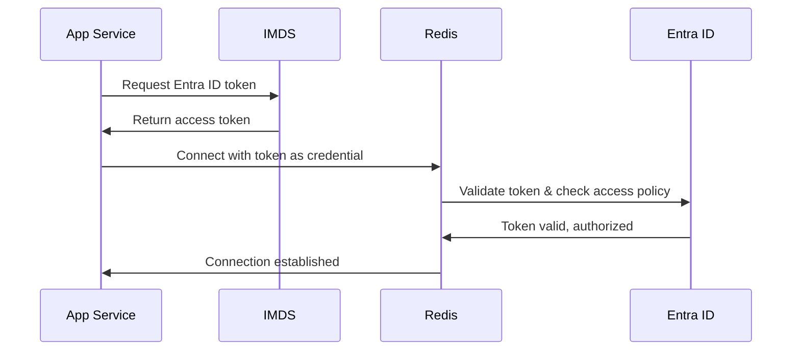

# How Entra ID Authentication Works with Azure Managed Redis

## Overview

This implementation uses **Microsoft Entra ID (formerly Azure AD)** for passwordless authentication to Azure Managed Redis, eliminating the need for access keys.

## 🔐 Authentication Flow



## 📦 Core Components

### 1. Install the Package

```python
# requirements.txt
redis==5.3.0
redis-entraid==1.0.0
```

### 2. Create Credential Provider

```python
from redis_entraid.cred_provider import (
    create_from_managed_identity, 
    ManagedIdentityType,
    ManagedIdentityIdType
)
import os

# Get managed identity client ID from environment
client_id = os.getenv('AZURE_CLIENT_ID')

# Create credential provider
credential_provider = create_from_managed_identity(
    identity_type=ManagedIdentityType.USER_ASSIGNED,
    resource="https://redis.azure.com/",
    id_type=ManagedIdentityIdType.CLIENT_ID,
    id_value=client_id
)
```

### 3. Connect to Redis

```python
import redis

# Create Redis client with Entra ID authentication
client = redis.Redis(
    host="your-redis.westus3.redis.azure.net",
    port=10000,
    credential_provider=credential_provider,
    ssl=True
)

# Use Redis normally
client.ping()  # Returns True
client.set('key', 'value')
value = client.get('key')
```

## 🎯 Key Concepts

### Token Management (Automatic)

The `redis-entraid` package handles:
- ✅ Initial token acquisition from Azure IMDS endpoint
- ✅ Token caching to avoid unnecessary requests
- ✅ Automatic token renewal before expiration
- ✅ Retry logic on transient failures

**You don't need to manage tokens manually!**

### Azure Configuration Required

#### 1. Managed Identity (Terraform)
```hcl
resource "azurerm_user_assigned_identity" "redis" {
  name                = "id-redis"
  resource_group_name = azurerm_resource_group.main.name
  location            = azurerm_resource_group.main.location
}
```

#### 2. Access Policy Assignment (Terraform with AzAPI)

**CRITICAL:** The Azure Managed Redis access policy API is different from Azure Cache for Redis.

```hcl
# Required: AzAPI provider (azurerm doesn't support this yet)
resource "azapi_resource" "redis_access_policy" {
  type      = "Microsoft.Cache/redisEnterprise/databases/accessPolicyAssignments@2024-10-01"
  name      = "app-managed-identity"
  parent_id = azurerm_managed_redis.main.database_id
  
  # Must disable schema validation as the resource type is not in the provider's schema yet
  schema_validation_enabled = false

  body = jsonencode({
    properties = {
      accessPolicyName = "default"  # MUST be "default" for Azure Managed Redis
      user = {
        objectId = azurerm_user_assigned_identity.redis.principal_id
      }
    }
  })
}
```

**Key Differences from Azure Cache for Redis:**
- ✅ Access policy name must be `"default"` (not custom names like "Data Contributor")
- ✅ User property is a **nested object** with `objectId` (not flat `objectId` + `objectIdAlias`)
- ✅ **Bicep/ARM**: Fully supported via native `Microsoft.Cache/redisEnterprise/databases/accessPolicyAssignments` resource
- ✅ **Terraform**: Must use AzAPI provider (azurerm doesn't support this resource type as of v4.x)
- ✅ Resource type is under `/databases/` path (not directly under cluster)

**For Bicep/ARM users:**

```bicep
resource accessPolicy 'Microsoft.Cache/redisEnterprise/databases/accessPolicyAssignments@2024-10-01' = {
  parent: database
  name: 'app-managed-identity'
  properties: {
    accessPolicyName: 'default'  // MUST be "default"
    user: {
      objectId: managedIdentity.properties.principalId
    }
  }
}
```

#### 3. App Service Identity Binding (Terraform)
```hcl
resource "azurerm_linux_web_app" "app" {
  # ... other config ...
  
  identity {
    type         = "UserAssigned"
    identity_ids = [azurerm_user_assigned_identity.redis.id]
  }
  
  app_settings = {
    REDIS_USE_ENTRA_ID    = "true"
    AZURE_CLIENT_ID       = azurerm_user_assigned_identity.redis.client_id
    REDIS_HOSTNAME        = azurerm_managed_redis.main.hostname
    REDIS_PORT            = "10000"
  }
}
```

#### 4. Disable Access Keys (Terraform)
```hcl
# Using AzAPI for Azure Managed Redis
resource "azapi_resource" "redis_database" {
  type      = "Microsoft.Cache/redisEnterprise/databases@2024-10-01"
  name      = "default"
  parent_id = azurerm_managed_redis_cluster.main.id
  
  body = jsonencode({
    properties = {
      accessKeysAuthentication = "Disabled"  # Force Entra ID only
      # ... other database properties
    }
  })
}
```

**Important:** When access keys are disabled:
1. ✅ All connections MUST use Entra ID authentication
2. ✅ Access policy assignment is REQUIRED
3. ✅ Traditional password-based connections will fail
4. ⚠️ Existing connections will be terminated when you disable access keys

## 🔄 How It Works Step-by-Step

### At Application Startup:

1. **App reads environment variables:**
   ```python
   client_id = os.getenv('AZURE_CLIENT_ID')  # Set by Terraform
   use_entra_id = os.getenv('REDIS_USE_ENTRA_ID')  # "true"
   ```

2. **Create credential provider:**
   ```python
   credential_provider = create_from_managed_identity(
       identity_type=ManagedIdentityType.USER_ASSIGNED,
       resource="https://redis.azure.com/",
       id_type=ManagedIdentityIdType.CLIENT_ID,
       id_value=client_id
   )
   ```

3. **Credential provider requests token from Azure:**
   - Calls Azure Instance Metadata Service (IMDS)
   - IMDS validates managed identity
   - Returns OAuth 2.0 access token
   - Token cached for ~1 hour

4. **Connect to Redis:**
   ```python
   client = redis.Redis(
       host=redis_host,
       port=redis_port,
       credential_provider=credential_provider,
       ssl=True
   )
   ```

5. **Token used as password:**
   - Redis receives token instead of password
   - Redis validates token with Entra ID
   - Checks access policy assignment
   - Grants access if valid

### During Operation:

6. **Automatic token renewal:**
   - Credential provider monitors token expiration
   - Requests new token before current expires
   - Updates connection automatically
   - **No application code needed!**

## 💡 Benefits

| Feature | Password Auth | Entra ID Auth |
|---------|--------------|---------------|
| **Secrets** | Must store/rotate passwords | No secrets needed |
| **Expiration** | Manual rotation required | Auto-renewed tokens |
| **Audit** | Limited | Full Azure AD audit trail |
| **Revocation** | Change password everywhere | Revoke identity access |
| **Zero Trust** | Password can leak | Identity-based, time-limited |

## 🛡️ Security Features

### 1. No Secrets in Code
```python
# ❌ OLD WAY (Insecure)
password = "mY5uP3r53cr3t!"  # Hardcoded!

# ✅ NEW WAY (Secure)
credential_provider = create_from_managed_identity(...)  # No secrets!
```

### 2. Automatic Token Rotation
- Tokens expire after ~1 hour
- New token requested automatically
- No service interruption

### 3. Centralized Access Control
```bash
# Grant access
az redisenterprise database access-policy-assignment create \
  --object-id <managed-identity-id>

# Revoke access (instant)
az redisenterprise database access-policy-assignment delete \
  --name "ManagedIdentityAccess"
```

### 4. Audit Trail
Every Redis operation logged in Azure AD with:
- Who (managed identity)
- When (timestamp)
- What (operation)
- Where (IP address)

## 🧪 Testing

### Local Testing (Limited)
```bash
# Install dependencies
pip install redis==5.3.0 redis-entraid==1.0.0

# Set mock client ID
export AZURE_CLIENT_ID="test-client-id"

# Test imports
python -c "from redis_entraid.cred_provider import create_from_managed_identity; print('✅')"
```

**Note:** Full connection requires Azure environment (managed identity, IMDS endpoint).

### Azure Testing
```bash
# Check health endpoint
curl https://your-app.azurewebsites.net/health

# Expected response:
# {
#   "status": "healthy",
#   "redis_connected": true,
#   "redis_auth_method": "Entra ID token"
# }
```

## 📚 Complete Example

```python
from redis_entraid.cred_provider import (
    create_from_managed_identity,
    ManagedIdentityType,
    ManagedIdentityIdType
)
import redis
import os

def get_redis_client():
    """Create Redis client with Entra ID authentication."""
    
    # Get configuration from environment
    client_id = os.getenv('AZURE_CLIENT_ID')
    redis_host = os.getenv('REDIS_HOSTNAME')
    redis_port = int(os.getenv('REDIS_PORT', 10000))
    
    # Create credential provider
    credential_provider = create_from_managed_identity(
        identity_type=ManagedIdentityType.USER_ASSIGNED,
        resource="https://redis.azure.com/",
        id_type=ManagedIdentityIdType.CLIENT_ID,
        id_value=client_id
    )
    
    # Connect to Redis
    return redis.Redis(
        host=redis_host,
        port=redis_port,
        credential_provider=credential_provider,
        ssl=True,
        decode_responses=True,
        socket_connect_timeout=5,
        socket_timeout=5
    )

# Usage
client = get_redis_client()
client.ping()  # Returns True
client.set('mykey', 'myvalue')
value = client.get('mykey')  # Returns 'myvalue'
```

## 🔗 References

- **Redis-py Entra ID Docs:** https://redis.io/docs/latest/develop/clients/redis-py/amr/
- **GitHub Repo:** https://github.com/redis/redis-py-entraid
- **Microsoft Docs:** https://learn.microsoft.com/en-us/azure/azure-cache-for-redis/managed-redis/managed-redis-entra-for-authentication

## 🐛 Troubleshooting

### "invalid username-password pair" Error

This means the managed identity doesn't have an access policy assignment.

**Solution:**
1. Verify access policy exists:
   ```bash
   az rest --method GET 
     --uri "/subscriptions/{subscription-id}/resourceGroups/{rg}/providers/Microsoft.Cache/redisEnterprise/{cluster}/databases/default/accessPolicyAssignments?api-version=2024-10-01"
   ```

2. Create access policy if missing:
   ```bash
   az rest --method PUT 
     --uri "/subscriptions/{sub}/resourceGroups/{rg}/providers/Microsoft.Cache/redisEnterprise/{cluster}/databases/default/accessPolicyAssignments/app-identity?api-version=2024-10-01" 
     --body '{
       "properties": {
         "accessPolicyName": "default",
         "user": {
           "objectId": "{managed-identity-principal-id}"
         }
       }
     }'
   ```

3. Restart your app to pick up the new permissions

### Connection Refused / Cannot Connect

**Check these in order:**

1. **VNet Integration** (for private endpoint):
   ```bash
   az webapp vnet-integration list --name {app-name} --resource-group {rg}
   ```

2. **Private DNS Resolution**:
   ```bash
   # From App Service Kudu console
   nslookup {redis-hostname}
   # Should resolve to private IP (e.g., 10.0.x.x)
   ```

3. **Managed Identity Assigned**:
   ```bash
   az webapp identity show --name {app-name} --resource-group {rg}
   ```

4. **AZURE_CLIENT_ID Environment Variable**:
   ```bash
   az webapp config appsettings list --name {app-name} --resource-group {rg} 
     --query "[?name=='AZURE_CLIENT_ID']"
   ```

### RBAC Role vs Access Policy

⚠️ **Both are required!**

- **RBAC Role Assignment** (`Redis Cache Contributor` on database resource):
  - Grants Azure management plane permissions
  - Required for the role assignment itself
  
- **Access Policy Assignment** (via API):
  - Grants Redis data plane access
  - **This is what allows authentication to work!**

Without the access policy, you'll get "invalid username-password pair" even with correct RBAC.

### Access Policy API Differences

Azure Managed Redis vs Azure Cache for Redis have **different APIs**:

| Property | Azure Cache for Redis | Azure Managed Redis |
|----------|----------------------|---------------------|
| Access Policy Name | Custom (e.g., "Data Contributor") | Must be "default" |
| Object structure | `objectId` + `objectIdAlias` (flat) | `user { objectId }` (nested) |
| Resource path | `/redis/{cache}/accessPolicyAssignments` | `/redisEnterprise/{cluster}/databases/{db}/accessPolicyAssignments` |
| Bicep/ARM | azurerm_redis_cache_access_policy_assignment | Microsoft.Cache/redisEnterprise/databases/accessPolicyAssignments |
| Terraform azurerm | Supported | **NOT supported (as of v4.x - Jan 2025)** |
| Terraform AzAPI | N/A | **Required for Terraform users** |

**Important Note**: While Bicep/ARM and Azure CLI fully support access policy assignments for Azure Managed Redis natively, the HashiCorp `azurerm` Terraform provider does not yet include this resource type. Terraform users must use the `azapi` provider as a workaround.

---

**Summary:** Entra ID authentication is simpler, more secure, and requires less code than traditional password-based authentication. The `redis-entraid` package handles all token management automatically. Just ensure you have BOTH the RBAC role assignment AND the access policy assignment configured correctly.

```
