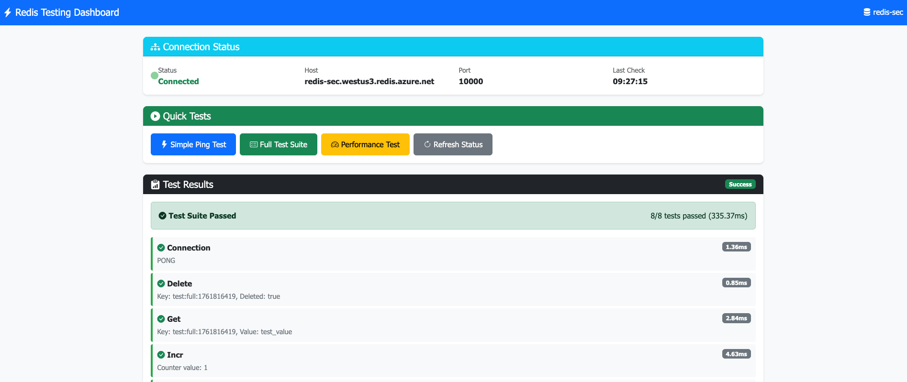

# Enterprise Security Example (Private Endpoint + High Availability + CMK + Managed Identity)

This example demonstrates Azure Managed Redis (Redis Enterprise) with **full enterprise-grade security features** using the **module with flexible provider support**.

## 🎨 Demo Application

This example includes a **Python test application** deployed to Azure App Service that demonstrates Entra ID authentication with Redis:



> **✅ Provider Flexibility**: 
> - **Redis cluster/database**: Supports both AzureRM and AzAPI providers (configured via `use_azapi` variable)
> - **Access policy assignments**: Require AzAPI for Terraform users (azurerm doesn't support this resource type yet)
> - **Bicep/ARM users**: All resources fully supported via native ARM resource types - no workarounds needed!
> - Currently configured to use **AzAPI** (`use_azapi = true`) for complete feature support with the latest Azure API

## 🔐 Security Features

This example showcases ALL enterprise security features available in Azure Managed Redis:

### 1. **Customer Managed Keys (CMK)** 🔑 ✅ IMPLEMENTED
- Encryption keys stored in Azure Key Vault (Premium tier)
- Full control over key rotation and lifecycle
- Meets compliance requirements (GDPR, HIPAA, SOC 2, etc.)
- Purge protection and soft delete enabled
- RBAC-based access control
- **Supported via AzAPI provider** with latest 2025-05-01-preview API

### 2. **Private Link** 🔒 ✅ IMPLEMENTED
- **No public internet access** - cluster is completely private
- Redis accessible only from within the Virtual Network
- Private DNS resolution for seamless connectivity
- Network isolation and enhanced security posture
- Compatible with hybrid cloud and on-premises connectivity
- **Note**: Application Security Groups (ASGs) can be associated via separate resource

### 3. **Managed Identity** 🆔 ✅ IMPLEMENTED
- No passwords or connection strings stored in code
- Azure AD-based authentication
- Automatic credential rotation
- Two identities:
  - **Redis Identity**: For the Redis cluster itself
  - **Key Vault Identity**: For CMK access
- RBAC role assignments for least-privilege access
- **Supported via AzAPI provider**

### 4. **Additional Security Features** ✅ IMPLEMENTED
- **High Availability**: Balanced SKU with zone redundancy
- **TLS 1.2 encryption**: Encrypted client protocol
- **Access Keys disabled**: EntraID authentication only
- **Resource tagging**: For governance and cost tracking

## 🏗️ Architecture

```
┌─────────────────────────────────────────────────────────────┐
│  Azure Subscription                                         │
│                                                             │
│  ┌───────────────────────────────────────────────────────┐  │
│  │  Virtual Network (10.0.0.0/16)                        │  │
│  │                                                       │  │
│  │  ┌─────────────────────────────────────────────────┐  │  │
│  │  │  Subnet (10.0.1.0/24)                           │  │  │
│  │  │                                                 │  │  │
│  │  │  ┌──────────────────────────────────────────┐   │  │  │
│  │  │  │  Private Endpoint                        │   │  │  │
│  │  │  │  ↓                                       │   │  │  │
│  │  │  │  Redis Enterprise Cluster (PRIVATE)      │   │  │  │
│  │  │  │  - SKU: Balanced_B3                      │   │  │  │
│  │  │  │  - Zones: 1, 2, 3 (HA)                   │   │  │  │
│  │  │  │  - CMK Encryption                        │   │  │  │
│  │  │  │  - Managed Identities                    │   │  │  │
│  │  │  │  - TLS 1.2                               │   │  │  │
│  │  │  │  - Access Keys: Disabled                 │   │  │  │
│  │  │  └──────────────────────────────────────────┘   │  │  │
│  │  └─────────────────────────────────────────────────┘  │  │
│  │                                                       │  │
│  │  ┌─────────────────────────────────────────────────┐  │  │
│  │  │  Private DNS Zone                               │  │  │
│  │  │  privatelink.redis.azure.net                    │  │  │
│  │  └─────────────────────────────────────────────────┘  │  │
│  └───────────────────────────────────────────────────────┘  │
│                                                             │
│  ┌───────────────────────────────────────────────────────┐  │
│  │  Key Vault (Premium)                                  │  │
│  │  - Customer Managed Key (RSA 2048)                    │  │
│  │  - RBAC Access Control                                │  │
│  │  - Purge Protection Enabled                           │  │
│  │  - Soft Delete (7 days)                               │  │
│  └───────────────────────────────────────────────────────┘  │
│                                                             │
│  ┌───────────────────────────────────────────────────────┐  │
│  │  User-Assigned Managed Identities                     │  │
│  │  ┌─────────────────────────────────────────────────┐  │  │
│  │  │  Redis Identity                                 │  │  │
│  │  │  - Assigned to Redis cluster                    │  │  │
│  │  │  - Used for EntraID authentication              │  │  │
│  │  └─────────────────────────────────────────────────┘  │  │
│  │  ┌─────────────────────────────────────────────────┐  │  │
│  │  │  Key Vault Identity                             │  │  │
│  │  │  - Role: Key Vault Crypto Service Encryption    │  │  │
│  │  │  - Access to CMK for encryption                 │  │  │
│  │  └─────────────────────────────────────────────────┘  │  │
│  └───────────────────────────────────────────────────────┘  │
└─────────────────────────────────────────────────────────────┘
```

## 📋 Prerequisites

### Azure Permissions
You need permissions to create:
- Virtual Networks and Subnets
- Private Endpoints and Private DNS Zones
- Key Vaults (Premium tier)
- Managed Identities
- Redis Enterprise clusters (Balanced SKU)
- Role assignments

### Azure Subscription Requirements
- Balanced SKU quota available
- Subscription must support:
  - Redis Enterprise in selected region
  - Premium Key Vault
  - Multi-zone deployments

### Tools
- **Terraform**: >= 1.7.5
- **Azure CLI**: Latest version
- **Authentication**: Azure CLI login (`az login`)

## 🚀 Quick Start

### Standard Deployment

```bash
cd examples/enterprise-security

# 1. Create terraform.tfvars from example
cp terraform.tfvars.example terraform.tfvars

# 2. Edit configuration (customize as needed)
code terraform.tfvars

# 3. Initialize Terraform
terraform init

# 4. Review planned changes
terraform plan

# 5. Deploy infrastructure (~15-20 minutes for Redis cluster)
terraform apply

# 6. View outputs
terraform output

# Note: The Python test application (app.zip) will be automatically
# deployed to the App Service during terraform apply!
```

### Modular (Phased) Deployment

For step-by-step deployment with more control:

```bash
cd examples/enterprise-security

# Run the modular deployment script
./scripts/deploy-modular.sh

# This will deploy in phases:
# - Phase 0: Random suffix generation
# - Phase 1: Network (VNet + Subnet)
# - Phase 2: Managed Identities
# - Phase 3: Key Vault & Encryption
# - Phase 4: Redis + Private Link
# - Phase 5: App Service + Automated App Deployment (via Terraform)

# You can skip phases you don't need!
```

### Switch Between Providers

This example supports both AzAPI and AzureRM providers:

```bash
# Currently using AzAPI (default)
# To switch to AzureRM:
./switch-provider.sh to-azurerm

# To switch back to AzAPI:
./switch-provider.sh to-azapi

# After switching, run:
terraform init -upgrade
terraform plan
```

### Provider Support & Terraform vs Bicep/ARM

This example uses the **managed-redis module** which supports both AzureRM and AzAPI providers via the `use_azapi` variable for the **Redis cluster and database resources**.

**Current Configuration: AzAPI Provider** (`use_azapi = true`)

#### Important Provider Notes:

##### For Terraform Users:

**Redis Cluster/Database:**
- ✅ **AzureRM provider**: Supported (use `use_azapi = false`)
- ✅ **AzAPI provider**: Supported (use `use_azapi = true`)

**Access Policy Assignments (required for EntraID auth):**
- ❌ **AzureRM provider**: NOT supported (as of v4.x - Jan 2025)
- ✅ **AzAPI provider**: REQUIRED - must always use AzAPI

This means:
- You can choose between `azurerm` or `azapi` for the main Redis resources
- Access policy assignments (`redis-access-policy.tf`) **always require AzAPI**
- The `azapi` provider must be included in your `versions.tf` regardless of your choice

##### For Bicep/ARM Users:

All resources including access policy assignments are **fully supported** via native resource types:
- `Microsoft.Cache/redisEnterprise` - Cluster
- `Microsoft.Cache/redisEnterprise/databases` - Database
- `Microsoft.Cache/redisEnterprise/databases/accessPolicyAssignments` - Access policies

No workarounds needed! See the [Azure Verified Modules (AVM)](https://github.com/Azure/bicep-registry-modules/tree/main/avm/res/cache/redis-enterprise) for Bicep examples.

**📚 For detailed provider comparison and limitations, see [PROVIDER_SUPPORT.md](./PROVIDER_SUPPORT.md)**

## 🔧 Configuration


**Why AzAPI for this example?**
- Full support for Customer Managed Keys (CMK) with the latest API
- Complete Managed Identity integration
- Access to all preview features (clusterless mode, persistence, etc.)
- Latest Azure API version (2025-05-01-preview)
- Same security features as AzureRM with enhanced flexibility

Both providers support all security features demonstrated in this example (CMK, Private Link, Managed Identity, TLS 1.2). See the Quick Start section above for how to switch providers.

### Key Variables

| Variable | Description | Default | Required |
|----------|-------------|---------|----------|
| `resource_group_name` | Resource group name | `rg-redis-enterprise-security` | No |
| `location` | Azure region | `northeurope` | No |
| `redis_name` | Redis cluster name | `redis-enterprise-secure` | No |
| `sku_name` | Redis SKU | `Balanced_B3` | No |
| `zones` | Availability zones | `["1", "2", "3"]` | No |
| `minimum_tls_version` | Minimum TLS version | `"1.2"` | No |
| `vnet_address_space` | VNet address space | `["10.0.0.0/16"]` | No |
| `redis_subnet_prefix` | Subnet address prefix | `["10.0.1.0/24"]` | No |
| `use_azapi` | Use AzAPI provider | `true` | No |
| `customer_managed_key_enabled` | Enable CMK encryption | `true` | No |
| `identity_type` | Managed identity type | `"UserAssigned"` | No |

### Example Configuration

```hcl
resource_group_name = "rg-redis-prod-secure"
location            = "westeurope"
redis_name          = "redis-prod-secure-001"
sku_name            = "Balanced_B5"  # Larger SKU for production
zones               = ["1", "2", "3"]
minimum_tls_version = "1.2"
use_azapi           = true  # Using AzAPI for full feature support

# Security configuration
customer_managed_key_enabled = true
identity_type                = "UserAssigned"

tags = {
  "Environment" = "production"
  "CostCenter"  = "engineering"
  "Owner"       = "platform-team"
  "Compliance"  = "GDPR-HIPAA"
}
```

## 💰 Cost Considerations

### Monthly Cost Breakdown

| Component | Estimated Monthly Cost | Notes |
|-----------|------------------------|-------|
| **Redis Balanced B3** | ~$600 | 3 zones, high availability |
| **Key Vault Premium** | ~$5 | Customer managed key storage |
| **Private Endpoint** | ~$10 | Per endpoint |
| **VNet** | ~$0 | No charge for VNet itself |
| **Data Transfer** | Variable | Depends on usage |
| **Total** | **~$615/month** | Approximate, region-dependent |

### Cost Optimization Tips

- 🔹 **Development/Testing**: Use `Balanced_B1` or `Balanced_B3`
- 🔹 **Production**: Consider `Balanced_B5` or higher based on workload
- 🔹 **Regional Pricing**: Costs vary by Azure region
- 🔹 **Reserved Instances**: Not available for Redis Enterprise (as of Oct 2025)
- 🔹 **Auto-scaling**: Not supported; choose appropriate SKU upfront
- 🔹 **Switch providers**: Both AzAPI and AzureRM have same costs

## 🧪 Testing

### Prerequisites for Testing
Since Redis is deployed with **Private Link only**, you need network access:

**Option 1: Deploy Test App Service with VNet Integration** ✨

This example includes infrastructure for a test application that is **automatically deployed**:

```bash
# When you run terraform apply, it will automatically:
# ✅ Create App Service with VNet integration
# ✅ Deploy the Python Flask application from app.zip
# ✅ Configure Application Insights for monitoring
# ✅ Set up Managed Identity for secure Redis access
# ✅ Configure Key Vault integration for secrets

# After terraform apply completes, test the app:
APP_URL=$(terraform output -raw app_service_url)

# Test health endpoint
curl "$APP_URL/api/health"

# Get API key and test Redis connectivity
API_KEY=$(az keyvault secret show \
  --vault-name $(terraform output -raw key_vault_id | awk -F/ '{print $NF}') \
  --name api-key \
  --query value -o tsv)

curl -H "X-API-Key: $API_KEY" "$APP_URL/api/redis/ping"
```

**How it works:**
- Terraform uses a `null_resource` with `local-exec` provisioner
- Automatically runs `az webapp deployment source config-zip` after App Service creation
- Deploys the `app.zip` file containing the Python Flask application
- Waits for the app to be healthy before completing
- Re-deploys automatically if `app.zip` content changes

**Option 2: Use Azure Bastion or VPN**
```bash
# Option A: Deploy Azure Bastion to securely access resources in the VNet
# Option B: Connect via VPN or ExpressRoute from on-premises
# Then test from within the connected network
```

### Test Commands (from within VNet)

```bash
# Get the connection details
HOSTNAME=$(terraform output -raw hostname)

# Note: This example has access keys DISABLED for security
# Authentication is via EntraID/Managed Identity only

# Test basic connectivity (EntraID auth)
redis-cli -h $HOSTNAME -p 10000 --tls --no-auth-warning PING
# Expected: PONG (if using managed identity from Azure resource)

# Test basic SET/GET operations
redis-cli -h $HOSTNAME -p 10000 --tls --no-auth-warning SET mykey "Hello Redis"
redis-cli -h $HOSTNAME -p 10000 --tls --no-auth-warning GET mykey
# Expected: "Hello Redis"

# If you need to test with access keys, they can be retrieved with:
# az redisenterprise database list-keys --cluster-name <name> --resource-group <rg>
```

## 🔍 Verification

### Verify Security Features

```bash
# Check Customer Managed Key
terraform output customer_managed_key_enabled
# Expected: true

# Check Managed Identities
terraform output managed_identity_redis_id
terraform output managed_identity_keyvault_id

# Check Private Endpoint
terraform output private_ip_address
# Should show a private IP in the 10.0.1.0/24 range

# Check High Availability
terraform output zones
# Expected: ["1", "2", "3"]

# View security summary
terraform output security_features
```

### Verify in Azure Portal

1. **Redis Cluster**:
   - Navigate to the Redis cluster
   - Check "Encryption" blade → should show Customer Managed Key
   - Check "Networking" blade → should show Private Endpoint only
   - Check "Identity" blade → should show User-Assigned Identities

2. **Key Vault**:
   - Navigate to the Key Vault
   - Check "Keys" blade → should show the CMK
   - Check "Access control (IAM)" → should show role assignments

3. **Private Endpoint**:
   - Navigate to the Private Endpoint
   - Check "DNS configuration" → should show private DNS zone
   - Check "Network interface" → should show private IP

## 📊 Outputs

After deployment, the following outputs are available:

| Output | Description | Sensitive |
|--------|-------------|-----------|
| `cluster_id` | Redis cluster resource ID | No |
| `cluster_name` | Redis cluster name | No |
| `hostname` | Redis hostname | No |
| `database_id` | Database resource ID | No |
| `database_name` | Database name | No |
| `access_keys_note` | How to retrieve access keys | No |
| `private_ip_address` | Private endpoint IP | No |
| `private_endpoint_id` | Private endpoint resource ID | No |
| `managed_identity_redis_id` | Redis identity ID | No |
| `managed_identity_keyvault_id` | Key Vault identity ID | No |
| `key_vault_id` | Key Vault resource ID | No |
| `customer_managed_key_id` | CMK resource ID | No |
| `customer_managed_key_enabled` | Whether CMK is enabled | No |
| `vnet_id` | Virtual network resource ID | No |
| `security_features` | Security features summary | No |
| `app_service_url` | Test application URL | No |
| `app_service_name` | Test application name | No |
| `app_deployment_status` | Application deployment status | No |
| `app_test_commands` | Commands to test the app | No |

### Get Outputs

```bash
# View all outputs
terraform output

# Get specific output
terraform output -raw hostname

# Get access keys (requires Azure CLI)
terraform output -raw access_keys_note
# Then run the az command shown
```

## 🧹 Cleanup

To destroy all resources:

```bash
terraform destroy
```

⚠️ **Warning**: This will delete:
- Redis Enterprise cluster and all data
- Key Vault and encryption keys (purge protection may apply)
- Private Endpoint and DNS zones
- Virtual Network
- Managed Identities
- Resource Group

## 🔧 Troubleshooting

### Issue: Key Vault Access Denied

**Symptom**: Error creating customer managed key

**Solution**:
```bash
# Ensure you have Key Vault Administrator role
az role assignment create \
  --role "Key Vault Administrator" \
  --assignee $(az account show --query user.name -o tsv) \
  --scope $(terraform output -raw key_vault_id)
```

### Issue: Redis Deployment Timeout

**Symptom**: Terraform times out during cluster creation

**Solution**:
- Redis Enterprise clusters take 15-20 minutes to deploy
- Increase timeout in `redis.tf` if needed
- Multi-zone deployments take longer than single-zone

### Issue: Cannot Connect to Redis

**Symptom**: Connection refused or timeout

**Solution**:
- Verify you're connecting from within the VNet
- Private Link blocks all public access
- Check NSG rules on the subnet
- Verify private DNS resolution

### Issue: CMK Encryption Fails

**Symptom**: Error during cluster creation with CMK

**Solution**:
- Ensure Key Vault has purge protection enabled
- Verify managed identity has correct role assignment
- Check that Key Vault allows the identity's access
- Confirm using AzAPI provider (`use_azapi = true`) for full CMK support
- Verify API version is 2025-05-01-preview or later

### Issue: Application Security Groups (ASG) Association

**Symptom**: "Private Link already exists" error when associating ASG to Private Endpoint

**Solution**:
```hcl
# Use separate resource with explicit dependency
resource "azurerm_network_interface_application_security_group_association" "redis_pe" {
  network_interface_id          = azurerm_private_endpoint.redis.network_interface[0].id
  application_security_group_id = azurerm_application_security_group.redis.id
  
  depends_on = [azurerm_private_endpoint.redis]
}

# Or add a delay to ensure PE is fully created
resource "time_sleep" "wait_for_pe" {
  create_duration = "30s"
  depends_on      = [azurerm_private_endpoint.redis]
}
```

**Why this happens**: Azure eventual consistency - the PE network interface may not be fully propagated when Terraform tries to associate the ASG. The association succeeds in Azure but Terraform reports an error due to state timing.

## 📚 References

### Official Documentation
- [Azure Managed Redis](https://learn.microsoft.com/azure/azure-cache-for-redis/managed-redis/managed-redis-overview)
- [Azure Private Link](https://learn.microsoft.com/azure/private-link/)
- [Customer Managed Keys](https://learn.microsoft.com/azure/azure-cache-for-redis/cache-how-to-encryption)
- [Managed Identities](https://learn.microsoft.com/azure/active-directory/managed-identities-azure-resources/)
- [Terraform azurerm Provider](https://registry.terraform.io/providers/hashicorp/azurerm/latest/docs)

### Related Examples
- [Simple Example](../simple/) - Basic Redis deployment
- [High Availability Example](../high-availability/) - HA configuration without security features
- [With Modules Example](../with-modules/) - Redis modules showcase
- [Geo-Replication Example](../geo-replication/) - Global deployment

## 🤝 Contributing

Found an issue or have a suggestion? Please open an issue or pull request!

## 📄 License

MIT License - See [LICENSE](../../LICENSE) for details
